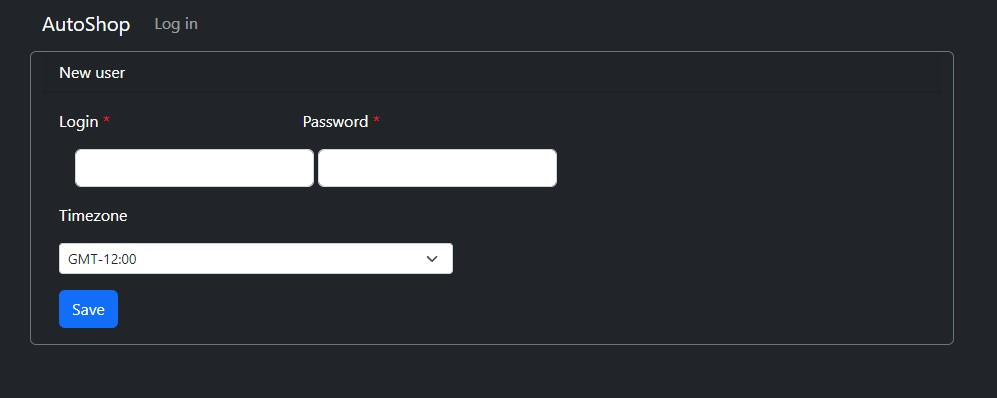
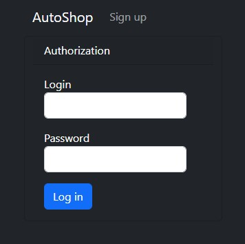
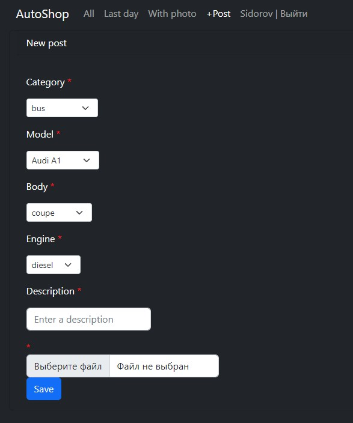
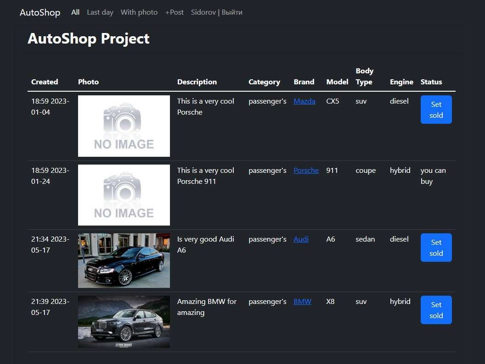
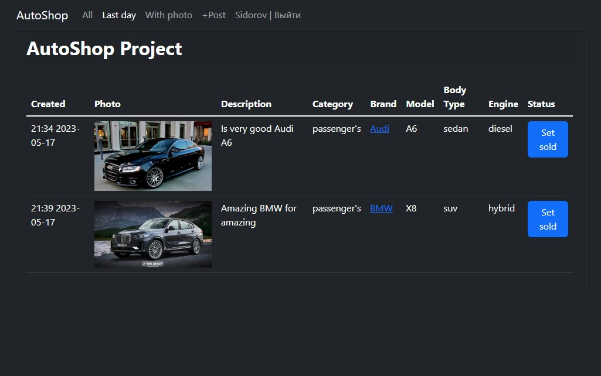
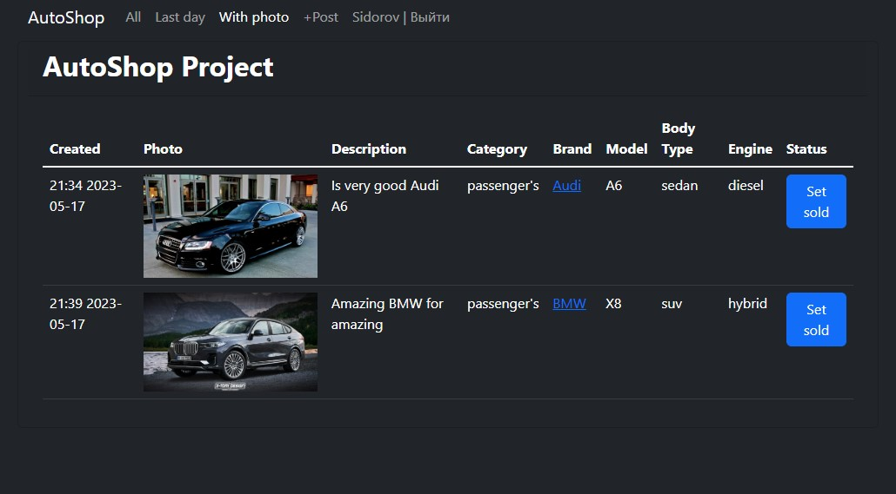

# AutoShop Webapp

## Web application for the sale and purchase of cars.

### About the application
+ The site contains ads with a description, brand of car, body type, photo. 
+ The ad has a status - sold or not. 

### Technology stack:
```text
+ Java 17;
+ Maven 4.0;
+ Spring boot;
+ Thymeleaf;
+ Bootstrap 5;
+ PostgreSQL 14;
+ JDBC;
+ Liquibase;
+ H2 1.4;
+ Log4j;
+ JUnit 5;
```

### Application launch
+ Recommended browser is Chrome.
1. Install PostgreSQL: login - postgres, password - password;
2. Create cinema database `CREATE DATABASE cars;`
3. If your Postgresql settings are different, you can make changes to the file `job4j_car\srс\main\resources\db.properties`
4. Navigate to the folder where you want to clone the project.
5. Clone the project repository to your project folder - run the command `git clone https://github.com/Oywayten/job4j_cars.git`
6. Navigate to the project folder.
7. Build the project and run the Spring Boot application `mvn clean package spring-boot:run`
8. Open link [http://localhost:8091/index](http://localhost:8091/index "go to AutoShop")

### Application interfaces
1. #### Registration form
   
2. #### Login form 
   
3. #### Add form 
   
4. #### All posts 
   
5. #### Last day posts 
   
6. #### Posts with photo 
   

### Contacts
+ email: [oywayten+git@gmail.com](mailto:oywayten+git@gmail.com)
+ telegram: [@VitaliyJVM](https://t.me/VitaliyJVM/ "go to t.me/VitaliyJVM")